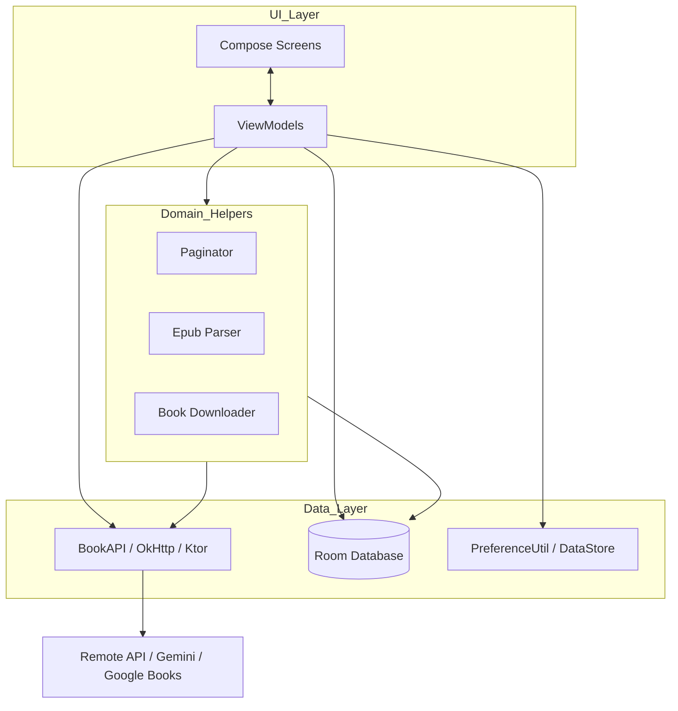

# System Architecture - BookLoop (Myne)

This document describes the high-level architecture and data flows of the BookLoop application.

## Overview
BookLoop is an Android application designed for discovering, downloading, and reading E-books (EPUB format). It leverages modern Android development practices, including Jetpack Compose for UI, Hilt for dependency injection, and Room for local persistence.

## Architectural Pattern
The application follows the **MVVM (Model-View-ViewModel)** architectural pattern combined with a layered approach:

1.  **UI Layer (Presentation):** Built using Jetpack Compose. It consists of Composables that observe state from ViewModels and trigger user actions.
2.  **ViewModel Layer:** Acts as a bridge between the UI and the Data layer. It manages UI state, handles user input, and interacts with repositories/helpers.
3.  **Data Layer:** Responsible for fetching and persisting data. It includes:
    *   **Remote Data Source:** API calls using `OkHttp` and `Ktor`.
    *   **Local Data Source:** Room Database for the library and reading progress, and DataStore/SharedPreferences for user settings.

---

## Key Components

### 1. Dependency Injection (`com.starry.myne.di`)
The app uses **Hilt** to manage dependencies. `MainModule` provides singleton instances of:
*   `BookAPI`: For network operations.
*   `MyneDatabase`: For local storage.
*   `PreferenceUtil`: For app settings.
*   `EpubParser`: For handling EPUB files.
*   `HttpClient`: For additional networking (Ktor).

### 2. Networking (`com.starry.myne.api`)
*   **`BookAPI`**: Centralized class for all network requests.
    *   Fetches books from a custom backend (`myne.abyx.in`).
    *   Retrieves extra book information (covers, descriptions) via the Google Books API.
    *   Generates book summaries using the **Gemini AI API**.
*   **Caching**: `CacheInterceptor` ensures efficient data retrieval and offline support for API responses.

### 3. Persistence (`com.starry.myne.database`)
Uses **Room** for local data management:
*   **Library (`LibraryDao`)**: Stores metadata of downloaded and imported books (`LibraryItem`).
*   **Progress (`ProgressDao`)**: Tracks reading progress, last read time, and reader settings for each book (`ProgressData`).
*   **DataStore**: Manages onboarding states and simple user preferences.

### 4. E-book Handling (`com.starry.myne.epub` & `helpers`)
*   **`EpubParser`**: Handles the complexities of parsing EPUB files, extracting metadata, and preparing content for the reader.
*   **`BookDownloader`**: Manages the downloading of EPUB files from the API to internal storage.

---

## Data Flows

### A. Book Discovery & Search
1.  `HomeScreen` triggers a request for books via `HomeViewModel`.
2.  `HomeViewModel` uses the `Paginator` helper to request data from `BookAPI`.
3.  `BookAPI` fetches JSON from the remote server.
4.  The results are filtered (ensuring EPUB availability) and updated in the `allBooksState`.
5.  `HomeScreen` observes the state and renders the book list.

### B. Library Management (Download/Import)
1.  **Download**: User clicks download -> `BookDownloader` fetches the file -> Metadata is saved to `LibraryDao` -> File is saved to internal storage.
2.  **Import**: User selects local EPUB -> `LibraryViewModel` uses `EpubParser` to extract metadata -> File is copied to internal storage -> Metadata is saved to `LibraryDao`.

### C. Reading Progress Tracking
1.  As the user reads in the `ReaderScreen`, updates are sent to its ViewModel.
2.  The ViewModel interacts with `ProgressDao` to update `ProgressData`.
3.  The `MainViewModel` uses this data to generate **Dynamic Shortcuts** on the Android home screen for "Recently Read" books.

### D. AI Summarization
1.  User requests a summary from the `DetailScreen`.
2.  `BookAPI.getBookSummaryFromGemini()` sends the book title to the Gemini API with a structured JSON schema.
3.  The resulting summary is parsed into `BookSummaryResponse` and displayed to the user.

---

## System Architecture Diagram (Conceptual)

